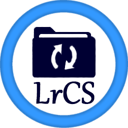
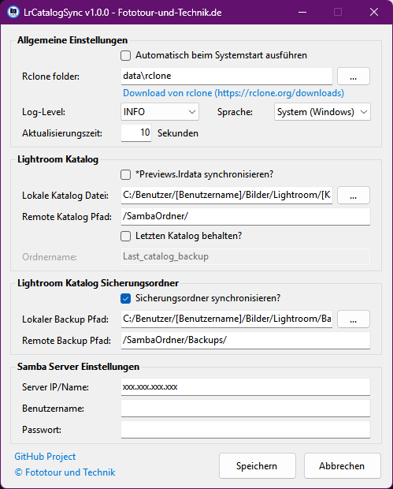
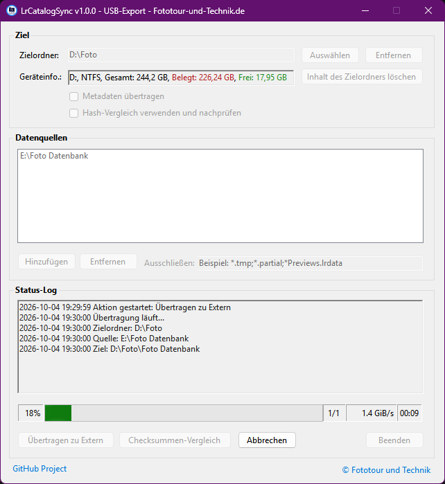

[English](README.md) | **Deutsch**

<h1> LrCatalogSync</h1>

- Das LrCatalogSync-Programm synchronisiert den Katalog samt Hilfsdateien von Adobe Lightroom Classic auf einen Samba-Server.
- Es erkennt, wenn ein Sync oder Lightroom Classic von einem anderen Rechner läuft, und verhindert das lokale Öffnen des Lightroom-Classic-Katalogs sowie den eigenen Sync-Prozess, um die Datenkonsistenz zu erhalten.
- LrCatalogSync startet mit Windows automatisch und ist über ein Symbol in der Taskleiste zu finden.

## Funktionsweise

### Kopierte Dateien
Beim Sync werden folgende Lightroom‑Dateien und Ordner synchronisiert:
- `*.lrcat` – Die Hauptkatalogdatei (SQL)
- `*.lrcat-data/` – Katalog-Datenbank (Masken, KI-Auswahlen)
- `* Sync.lrdata/` – Für Adobe Creative Cloud
- `* Smart Previews.lrdata/` – kleine Vorschaudateien von Raw/DNG
- `* Helper.lrdata/` – Hilfsdaten für Katalogfunktionen

Optional (siehe Einstellungen):
- `* Previews.lrdata/` – Standard und 1:1 Vorschaudateien (Option **\*Previews.lrdata synchronisieren?**)

Sicherungsordner (Option **Sicherungsordner synchronisieren?**):
- Der Lightroom-Sicherungsordner (Katalog-Backups) wird separat und in beide Richtungen abgeglichen (rclone `bisync`).

### Lock-Dateien (Lightroom-Erkennung)
Das Programm erkennt automatisch, wenn Lightroom geöffnet ist, und verzichtet dann auf den Sync:
- `*.lrcat.lock` – Haupt-Lock-Datei
- `*.lrcat-shm` – Shared Memory Segment
- `*.lrcat-wal` – Write-Ahead Log

Diese Dateien werden von Lightroom Classic beim Öffnen des Katalogs erstellt und beim Schließen wieder gelöscht.

## Voraussetzungen
- Windows 10 oder Windows Server 2016 oder neuer
- Internetverbindung beim ersten Start, wenn rclone noch nicht vorhanden ist

## Installation
1. LrCatalogSync von GitHub herunterladen und `LrCatalogSync.exe` starten – das Symbol erscheint im Tray.
2. Wenn noch keine rclone-Version vorhanden ist, lädt LrCatalogSync beim Start automatisch das aktuelle stabile Windows-AMD64-Release von [rclone.org](https://downloads.rclone.org/rclone-current-windows-amd64.zip) herunter und legt `rclone.exe` unter `data/rclone/` ab.
3. Bei weiteren Starts wird nach einer neueren Version gesucht. Ist rclone bereits vorhanden, bleibt es bei fehlender Verbindung zur Downloadseite nutzbar.

Falls der automatische Download nicht verfügbar ist, rclone manuell von [rclone.org](https://rclone.org/downloads/) herunterladen, entpacken und in den Einstellungen den Ordner mit `rclone.exe` eintragen. Ein bereits konfigurierter manueller Pfad bleibt erhalten und wird nicht automatisch ersetzt.

## Nutzung
*Start:* Doppelklick auf `LrCatalogSync.exe` (kann beim Systemstart aktiviert werden). 

*Stop:* Rechtsklick auf das Tray‑Icon → **Beenden**.

## Konfiguration (grafisch)
Rechtsklick auf das Tray‑Icon → **Einstellungen**

| Feld | Beschreibung |
|------|--------------|
| **Automatisch beim Systemstart ausführen** | Programm beim Windows-Start automatisch ausführen |
| **Rclone folder** | Ordner mit `rclone.exe`; Standard ist `data/rclone/`. Ein anderer Ordner kann manuell eingetragen werden. |
| **Log‑Level** | `DEBUG`, `INFO`, `NOTICE`, `ERROR` |
| **Sprache** | `System` (Windows-Anzeigesprache), `English` oder `Deutsch`. Nicht unterstützte Windows-Sprachen verwenden Englisch. |
| **Aktualisierungszeit** | Prüfintervall in Sekunden (1 bis 999, Standard 10) |
| **\*Previews.lrdata synchronisieren?** | Auswahl, ob der Ordner `* Previews.lrdata` (Standard- und 1:1-Vorschauen) auch synchronisiert werden soll |
| **Lokale Katalog Datei** | Pfad zur `.lrcat`‑Datei (lokal) |
| **Remote Katalog Pfad** | Zielpfad auf dem SMB‑Server (z. B. `//192.168.1.1/Lightroom/` -> `/Lightroom/`) |
| **Letzten Katalog behalten?** | Legt vor dem Sync eine Kopie des bisherigen Katalogs in einem Extra-Ordner ab (beim Upload auf dem Server, beim Download lokal) |
| **Ordnername** | Name des Ordners für diese Kopie |
| **Lokaler Backup Pfad** | Lokaler Pfad, wo die Sicherungsdateien von Lightroom liegen |
| **Remote Backup Pfad** | Zielpfad auf dem SMB-Server für die Sicherungsdateien |
| **Server IP/Name** | IP oder Hostname des SMB‑Servers |
| **Benutzername / Passwort** | Zugangsdaten (verschlüsselt gespeichert) |
| **Sicherungsordner synchronisieren?** | Optional, Lightroom-Sicherungsordner lokal und remote abgleichen |

Einstellungen werden in `data/config/` gespeichert.
Die Benutzeroberfläche und die von LrCatalogSync erzeugten Logmeldungen folgen der ausgewählten Sprache. `System` verwendet Deutsch oder Englisch entsprechend der Windows-Anzeigesprache; bei anderen Sprachen gilt Englisch. rclone-eigene Logmeldungen bleiben in der von rclone gelieferten Sprache.

## TrayIcon

Tray‑Icon‑Status:
- 🟢 --> bereit, kein Sync aktiv
- 🟠  --> Synchronisiere Lightroom-Sicherungsordner
- 🟡  --> Synchronisiere Lightroom-Katalog 
- 🔵  --> Lightroom Classic ist lokal aktiv und Sync wird blockiert
- 🔵 --> Wenn der PC während des Syncs neugestartet wurde, wird dieser Recovery-Prozess gestartet
- 🟣  --> Ein Sync läuft gerade von einem anderen Rechner
- 🟣 --> Lightroom Classic wurde auf einem anderen Rechner gestartet
- 🔴 --> Fehler (z. B. keine Samba-Verbindung, rclone fehlt, veralteter Remote-Lock), siehe Log (Notfalls auf Debug stellen)
- ⚪ --> Konfigurationsdatei fehlt
-  --> Sync ist ausgeschaltet (Tray-Menü **Ausschalten** bzw. USB-Export geöffnet)

Tray-Menü: **USB-Export**, **Ausschalten/Einschalten**, **Einstellungen**, **Beenden**.

Logs finden Sie unter `data/logs/`.

## USB-Export (Zusatztool)

Mit dem USB-Export lassen sich beliebige Ordner (z. B. Foto-Datenbank, Lightroom-Katalog, Bilderarchiv) auf einen externen Datenträger kopieren. Das Tool ist Teil von LrCatalogSync und nutzt ebenfalls rclone.

### Öffnen
Rechtsklick auf das Tray‑Icon → **USB-Export**. Solange das Fenster geöffnet ist, ist der normale Sync pausiert (Menüeintrag zeigt „USB-Export geöffnet“). Nach dem Schließen wird der vorherige Zustand (Sync an/aus) wiederhergestellt. Läuft gerade ein normaler Sync-Zyklus, sind alle Eingaben und Aktionen gesperrt, bis dieser beendet ist; das Fenster kann dann nicht geschlossen werden.

### Bereiche und Bedienelemente
| Bereich / Element | Beschreibung |
|-------------------|--------------|
| **Zielordner** | Zielordner auf dem externen Laufwerk (**Auswählen** / **Entfernen**). Das Laufwerk wird aus dem Pfad abgeleitet. |
| **Geräteinfo** | Laufwerk, Dateisystem, Gesamtgröße, belegter (rot) und freier (grüner) Speicher; wird automatisch aktualisiert |
| **Inhalt des Zielordners löschen** | Leert den Zielordner nach Sicherheitsabfrage. Bei einem Laufwerks-Stammverzeichnis wird das ganze Laufwerk geleert (Windows-Systemordner bleiben erhalten). |
| **Metadaten übertragen** | Überträgt zusätzlich Dateimetadaten. Nur wählbar, wenn das Ziel NTFS-formatiert ist. |
| **Hash-Vergleich verwenden und nachprüfen** | Vergleicht Dateien per Prüfsumme statt Größe/Datum und führt nach der Übertragung automatisch einen Prüfsummen-Vergleich durch |
| **Datenquellen** | Liste der zu kopierenden Ordner (**Hinzufügen** / **Entfernen**) |
| **Ausschließen** | Eigene Ausschlussmuster, getrennt durch `;` (z. B. `*.tmp;*.partial;*Previews.lrdata`) |
| **Status-Log** | Meldungen der laufenden Aktion (Fehler rot, erfolgreiche Prüfung grün) |
| **Fortschrittsanzeige** | Prozent, aktueller Abschnitt (z. B. 1/2), Geschwindigkeit und verstrichene Zeit |
| **Übertragen zu Extern** | Startet die Übertragung aller Datenquellen in den Zielordner |
| **Checksummen-Vergleich** | Vergleicht Quellen und Ziel per Prüfsumme, ohne etwas zu kopieren |
| **Abbrechen** | Bricht die laufende Aktion ab |
| **Beenden** | Schließt das Fenster (während einer Aktion nicht möglich; das Schließen fragt nach, ob abgebrochen werden soll) |

### Ablauf einer Übertragung
1. Zielordner auf dem externen Laufwerk wählen.
2. Eine oder mehrere Datenquellen hinzufügen. Optional Ausschlussmuster, Metadaten und Hash-Vergleich einstellen.
3. **Übertragen zu Extern** klicken.
4. Vorab wird geprüft, ob Laufwerk und Quellen erreichbar sind und ob in den Quellen Lightroom-Lock-Dateien (`*.lrcat.lock`, `*.lrcat-shm`, `*.lrcat-wal`) liegen. Ist Lightroom noch geöffnet, wird die Übertragung abgelehnt und die Lock-Dateien werden im Log aufgelistet.
5. Jede Datenquelle wird in einen eigenen Unterordner des Zielordners (Name des Quellordners) übertragen. Bei gleichen Namen wird der Ordnername um übergeordnete Ordner bzw. den Laufwerksbuchstaben und bei Bedarf um eine Nummer ergänzt.
6. Bei aktivem Hash-Vergleich folgt danach automatisch der Prüfsummen-Vergleich. Das Ergebnis (fehlende, abweichende oder nicht lesbare Dateien) steht im Status-Log.

> **Achtung:** Die Übertragung ist eine Synchronisation (`rclone sync`). Dateien im Zielunterordner, die in der Quelle nicht (mehr) existieren, werden gelöscht. Die Quelle wird nie verändert.

### Automatisch ausgeschlossen
Unabhängig von den eigenen Mustern werden nie übertragen oder gelöscht:
- `*.lrcat.lock`, `*.lrcat-shm`, `*.lrcat-wal`, `*.lock`, `Thumbs.db`
- Windows-Systemordner im Laufwerks-Stamm: `System Volume Information`, `$RECYCLE.BIN`, `Recovery`

### Besonderheiten
- Ist der Datenträger voll, wird die Übertragung abgebrochen und der fehlende Speicherplatz (in GB) im Log gemeldet.
- Einstellungen (Ziel, Quellen, Ausschlüsse, Optionen) werden automatisch gespeichert in `data/config/USBExport.conf`. Eine eigene rclone-Konfiguration liegt in `data/config/USBExportRclone.conf`.
- Das Protokoll steht in `data/logs/USBExport.log`.
- Voraussetzung ist eine vorhandene `rclone.exe` (siehe Installation).

## Fehlersuche (Kurz)
- *rclone.exe nicht gefunden*: Internetverbindung beim ersten Start prüfen. Bei einem manuellen Pfad muss der ausgewählte Ordner die `rclone.exe` enthalten.
- *Samba‑Verbindung fehlgeschlagen*: IP, Benutzer, Passwort und Netzwerk prüfen.

## Ressourcen
- GitHub: https://github.com/Raychan87/LrCatalogSync
- rclone: https://rclone.org
- Lightroom Classic: https://www.adobe.com/de/products/photoshop-lightroom-classic.html

*Version **1.0.0** – Stand: Oktober 2026*

