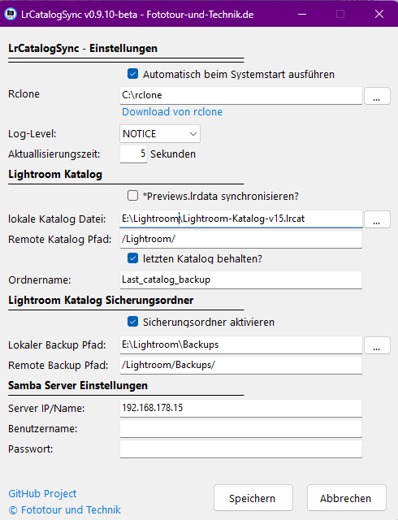

# ACHTUNG!
Aktuell ist es noch eine Beta und kann/wird Fehler enthalten. Versioniertes Backup eures Lightroom Katalogs ist immer zu empfehlen.

# LrCatalogSync

Synchronisiert Adobe Lightroom Classic‑Kataloge über Samba Server/NAS.
Das Programm erkennt, wenn Lightroom Classic läuft, und verzichtet dann auf den Sync, um Katalogkorruptionen zu vermeiden.
Es synchronisiert alle vom Lightroom Katalog benötigten Hilfsdateien.
LrCatalogSync ist dafür gedacht, Lightroom Classic auf mehreren Rechnern zu betreiben und diese über ein NAS mit Samba zu synchronisieren.
Es zeigt über ein Symbol im Traymenü den Status des Programms an und kann im Autostart hinterlegt werden.
Es blockiert auch den Lightroom katalog, wenn ein gerade ein Sync vom eigenen Rechner statt findet oder ein anderer Rechner gerade auf dem Samba Share eine neue Lightroom version hochlädt, damit die aktuelle Version wieder heruntergeladen kann.

## Funktionsweise

### Kopierte Dateien
Beim Sync werden folgende Lightroom‑Dateien und Ordner synchronisiert:
- `*.lrcat` – Die Hauptkatalogdatei (SQL)
- `*.lrcat-data/` – Katalog-Datenbank (Masken, KI-Auswahlen)
- `* Sync.lrdata/` – Für Adobe Creative Cloud
- `* Smart Previews.lrdata/` – kleine Vorschaudateien von Raw/DNG
- `* Helper.lrdata/` – Hilfsdaten für Katalogfunktionen
Optional(siehe Einstellungen)):
- `* Previews.lrdata/` – Standard und 1:1 Vorschaudateien 
- `Katalog Backups *.zip` - Automatische Sicherungsdaten von Lightroom

### Lock-Dateien (Lightroom-Erkennung)
Das Programm erkennt automatisch, wenn Lightroom geöffnet ist, und verzichtet dann auf den Sync:
- `*.lrcat.lock` – Haupt-Lock-Datei
- `*.lrcat-shm` – Shared Memory Segment
- `*.lrcat-wal` – Write-Ahead Log

Diese Dateien werden von Lightroom Classic beim Öffnen des Katalogs erstellt und beim Schließen wieder gelöscht.

## Voraussetzungen
- ab Windows 8.1
- **rclone** (https://rclone.org)

## Installation
1. rclone herunterladen, `rclone.exe` z. B. nach `C:\Programme\rclone` entpacken.
2. LrCatalogSync von GitHub herunterladen und `LrCatalogSync.exe` starten – das Symbol erscheint im Tray.

## Nutzung
*Start:* Doppelklick auf `LrCatalogSync.exe` (kann beim Systemstart aktiviert werden). 
*Stop:* Rechtsklick auf das Tray‑Icon → **Beenden**.

## Konfiguration (grafisch)

| Feld | Beschreibung |
|------|--------------|
| **Auto-Start** | Programm beim Windows-Start automatisch ausführen |
| **rclone‑Pfad** | Pfad zur `rclone.exe` (z. B. `C:\Programme\rclone\rclone.exe`) |
| **Log‑Level** | `DEBUG`, `INFO`, `NOTICE`, `ERROR` |
| **Katalog‑Datei** | Pfad zur `.lrcat`‑Datei (lokal) |
| **Remote‑Pfad** | Zielpfad auf dem SMB‑Server (z. B. `/Lightroom/`) |
| **letzten Katalog behalten?** | Speichert vor den Sync den Katalog in ein Extra Ordner |
| **Ordnername** | Für die letzten Katalogspeicherung |
| **Backup Pfad** | Für die Lightroom Sicherungsdateien (Optional für den Sync) |
| **Server‑IP / Host** | IP oder Hostname des SMB‑Servers |
| **Benutzer / Passwort** | Zugangsdaten (verschlüsselt gespeichert) |
| **Backup aktivieren** | Optional, lokale und Remote‑Backups synchronisieren |

Einstellungen werden in `data/config/` gespeichert.

## TrayIcon

Tray‑Icon‑Status:
- 🟢 Standby – bereit, kein Sync aktiv
- 🟠 Syncing – Synchronisiere Lightroom Sicherungsordner
- 🟡 Syncing – Synchronisiere Lightroom Katalog 
- 🔵 Lock – Lightroom Classic ist aktiv und Sync wird blockiert
- 🔵 Crash Recovery - Wenn der PC während des Sync neugestartet wurde, wird dieser Recovery Prozess gestartet
- 🟣 Remote Lock – Ein Sync läuft gerade von einen anderen Rechner
- 🔴 Error/SMB/rclone – Fehler, siehe Log
- ⚪ Error – Konfigurationsdatei fehlt

Logs finden Sie unter `data/logs/`.

## Fehlersuche (Kurz)
- *rclone.exe nicht gefunden*: Pfad prüfen.
- *Samba‑Verbindung fehlgeschlagen*: IP, Benutzer, Passwort und Netzwerk prüfen.
- *Kein *.lrcat* gefunden*: Pfad zum Katalog korrekt angeben.
- *Lock erkannt*: Lightroom läuft, Sync wird automatisch übersprungen.

## Ressourcen
- GitHub: https://github.com/Raychan87/LrCatalogSync
- rclone: https://rclone.org
- Lightroom Classic: https://www.adobe.com/de/products/photoshop-lightroom-classic.html

*Version **0.9.9-beta** – Stand: August 2026*

