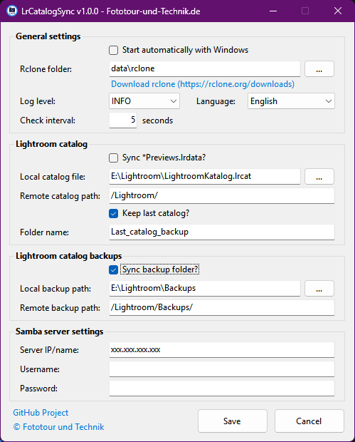
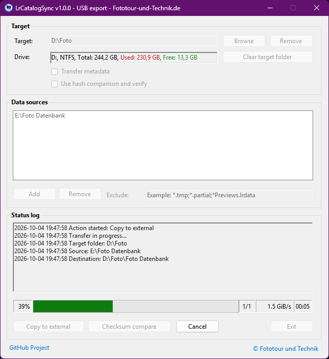

**English** | [Deutsch](README.de.md)

<h1> LrCatalogSync</h1>

- LrCatalogSync synchronizes the Adobe Lightroom Classic catalog and its helper files to a Samba server.
- It detects when a sync or Lightroom Classic is running on another computer, and prevents opening the Lightroom Classic catalog locally as well as its own sync process in order to keep the data consistent.
- LrCatalogSync starts automatically with Windows and can be found as an icon in the system tray.

## How it works

### Copied files
The following Lightroom files and folders are synchronized:
- `*.lrcat` – the main catalog file (SQL)
- `*.lrcat-data/` – catalog database (masks, AI selections)
- `* Sync.lrdata/` – for Adobe Creative Cloud
- `* Smart Previews.lrdata/` – small preview files of Raw/DNG
- `* Helper.lrdata/` – helper data for catalog functions

Optional (see settings):
- `* Previews.lrdata/` – standard and 1:1 previews (option **Sync \*Previews.lrdata?**)

Backup folder (option **Sync backup folder?**):
- The Lightroom backup folder (catalog backups) is synchronized separately and in both directions (rclone `bisync`).

### Lock files (Lightroom detection)
The program detects automatically when Lightroom is open and skips the sync:
- `*.lrcat.lock` – main lock file
- `*.lrcat-shm` – shared memory segment
- `*.lrcat-wal` – write-ahead log

Lightroom Classic creates these files when the catalog is opened and deletes them when it is closed.

## Requirements
- Windows 10 or Windows Server 2016 or newer
- Internet connection on first start if rclone is not yet available

## Installation
1. Download LrCatalogSync from GitHub and start `LrCatalogSync.exe` – the icon appears in the tray.
2. If no rclone version is available yet, LrCatalogSync automatically downloads the current stable Windows AMD64 release from [rclone.org](https://downloads.rclone.org/rclone-current-windows-amd64.zip) on startup and stores `rclone.exe` in `data/rclone/`.
3. On later starts it checks for a newer version. If rclone is already present, it stays usable when the download site cannot be reached.

If the automatic download is not available, download rclone manually from [rclone.org](https://rclone.org/downloads/), unpack it and enter the folder containing `rclone.exe` in the settings. A manually configured path is kept and is not replaced automatically.

## Usage
*Start:* double-click `LrCatalogSync.exe` (can be enabled at system start).

*Stop:* right-click the tray icon → **Exit**.

## Configuration (GUI)
Right-click the tray icon → **Settings**

| Field | Description |
|-------|-------------|
| **Start automatically with Windows** | Run the program automatically at Windows startup |
| **Rclone folder** | Folder containing `rclone.exe`; default is `data/rclone/`. Another folder can be entered manually. |
| **Log level** | `DEBUG`, `INFO`, `NOTICE`, `ERROR` |
| **Language** | `System` (Windows display language), `English` or `Deutsch`. Unsupported Windows languages use English. |
| **Check interval** | Check interval in seconds (1 to 999, default 10) |
| **Sync \*Previews.lrdata?** | Whether the `* Previews.lrdata` folder (standard and 1:1 previews) is synchronized as well |
| **Local catalog file** | Path to the local `.lrcat` file |
| **Remote catalog path** | Target path on the SMB server (e.g. `//192.168.1.1/Lightroom/` -> `/Lightroom/`) |
| **Keep last catalog?** | Before syncing, stores a copy of the previous catalog in an extra folder (on the server for uploads, locally for downloads) |
| **Folder name** | Name of the folder for this copy |
| **Sync backup folder?** | Optional, synchronizes the Lightroom backup folder locally and remotely |
| **Local backup path** | Local path where Lightroom stores its backups |
| **Remote backup path** | Target path on the SMB server for the backups |
| **Server IP/name** | IP or host name of the SMB server |
| **Username / Password** | Credentials (stored encrypted) |

Settings are stored in `data/config/`.
The user interface and the log messages generated by LrCatalogSync follow the selected language. `System` uses German or English according to the Windows display language; other languages fall back to English. rclone's own log messages stay in the language provided by rclone.

## Tray icon

Tray icon status:
- 🟢 --> ready, no sync active
- 🟠 --> synchronizing the Lightroom backup folder
- 🟡 --> synchronizing the Lightroom catalog
- 🔵 --> Lightroom Classic is active locally and the sync is blocked
- 🔵 --> the PC was restarted during a sync, this recovery process is started
- 🟣 --> a sync is currently running from another computer
- 🟣 --> Lightroom Classic was started on another computer
- 🔴 --> error (e.g. no Samba connection, rclone missing, stale remote lock), see log (set to Debug if necessary)
- ⚪ --> configuration file missing
-  --> sync is switched off (tray menu **Turn off** or USB export open)

Tray menu: **USB export**, **Turn off/Turn on**, **Settings**, **Exit**.

Logs are located in `data/logs/`.

## USB export (additional tool)

The USB export copies arbitrary folders (e.g. photo library, Lightroom catalog, image archive) to an external drive. The tool is part of LrCatalogSync and also uses rclone.

### Opening
Right-click the tray icon → **USB export**. While the window is open, the normal sync is paused (the menu entry shows "USB export open"). After closing, the previous state (sync on/off) is restored. If a normal sync cycle is running, all inputs and actions are locked until it has finished; the window cannot be closed in that case.

### Areas and controls
| Area / element | Description |
|----------------|-------------|
| **Target** | Target folder on the external drive (**Browse** / **Remove**). The drive is derived from the path. |
| **Drive** | Drive, file system, total size, used (red) and free (green) space; updated automatically |
| **Clear target folder** | Empties the target folder after a confirmation. For a drive root, the whole drive is emptied (Windows system folders are kept). |
| **Transfer metadata** | Additionally transfers file metadata. Only selectable if the target is NTFS-formatted. |
| **Use hash comparison and verify** | Compares files by checksum instead of size/date and automatically runs a checksum comparison after the transfer |
| **Data sources** | List of folders to copy (**Add** / **Remove**) |
| **Exclude** | Custom exclude patterns separated by `;` (e.g. `*.tmp;*.partial;*Previews.lrdata`) |
| **Status log** | Messages of the running action (errors in red, successful verification in green) |
| **Progress display** | Percentage, current section (e.g. 1/2), speed and elapsed time |
| **Copy to external** | Starts the transfer of all data sources into the target folder |
| **Checksum compare** | Compares sources and target by checksum without copying anything |
| **Cancel** | Cancels the running action |
| **Exit** | Closes the window (not possible during an action; closing via the window asks whether to cancel) |

### Transfer procedure
1. Select the target folder on the external drive.
2. Add one or more data sources. Optionally set exclude patterns, metadata and hash comparison.
3. Click **Copy to external**.
4. Beforehand it is checked whether the drive and sources are reachable and whether the sources contain Lightroom lock files (`*.lrcat.lock`, `*.lrcat-shm`, `*.lrcat-wal`). If Lightroom is still open, the transfer is rejected and the lock files are listed in the log.
5. Each data source is transferred into its own subfolder of the target folder (name of the source folder). For identical names, the folder name is extended by parent folders or the drive letter and, if necessary, a number.
6. With hash comparison enabled, a checksum comparison follows automatically. The result (missing, differing or unreadable files) is shown in the status log.

> **Warning:** The transfer is a synchronization (`rclone sync`). Files in the target subfolder that no longer exist in the source are deleted. The source is never modified.

### Automatically excluded
Regardless of custom patterns, the following are never transferred or deleted:
- `*.lrcat.lock`, `*.lrcat-shm`, `*.lrcat-wal`, `*.lock`, `Thumbs.db`
- Windows system folders in the drive root: `System Volume Information`, `$RECYCLE.BIN`, `Recovery`

### Notes
- If the drive is full, the transfer is aborted and the missing space (in GB) is reported in the log.
- Settings (target, sources, excludes, options) are saved automatically in `data/config/USBExport.conf`. A separate rclone configuration is stored in `data/config/USBExportRclone.conf`.
- The log is written to `data/logs/USBExport.log`.
- An existing `rclone.exe` is required (see Installation).

## Troubleshooting (short)
- *rclone.exe not found*: check the internet connection on first start. With a manual path, the selected folder must contain `rclone.exe`.
- *Samba connection failed*: check IP, user, password and network.

## Resources
- GitHub: https://github.com/Raychan87/LrCatalogSync
- rclone: https://rclone.org
- Lightroom Classic: https://www.adobe.com/products/photoshop-lightroom-classic.html

*Version **1.0.0** – as of: October 2026*
